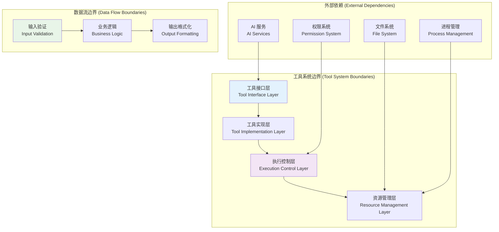

# 工具系统模块 (Tool System Module)

## 职责与边界 (Responsibilities & Boundaries)

### 核心职责 (Core Responsibilities)

工具系统模块是 Kode 架构的**执行引擎 (Execution Engine)**，负责将 AI 的意图转化为实际的系统操作。其核心职责包括：

1. **功能抽象与标准化 (Function Abstraction & Standardization)**
   - 将所有系统功能抽象为统一的 Tool 接口
   - 提供标准化的输入验证、执行流程和结果格式化机制
   - 确保工具间的一致性和互操作性

2. **安全执行控制 (Safe Execution Control)**
   - 实施细粒度的权限检查机制 (Fine-Grained Permission Checking)
   - 提供沙箱化的执行环境 (Sandboxed Execution Environment)
   - 防范恶意操作和系统安全威胁

3. **并发与性能优化 (Concurrency & Performance Optimization)**
   - 智能分析工具依赖关系，实现安全的并行执行
   - 提供流式处理和进度反馈机制
   - 实施资源管理和性能监控

4. **可扩展性支持 (Extensibility Support)**
   - 支持动态工具注册和卸载
   - 提供插件化架构基础
   - 集成外部 MCP (Model Context Protocol) 工具

### 设计边界 (Design Boundaries)



**边界约束 (Boundary Constraints)**：
- 工具只能通过标准接口与外部系统交互
- 所有文件操作必须通过权限系统验证
- 网络访问受到严格的安全策略限制
- 系统资源使用受到配额和监控限制

## 设计模式与核心逻辑 (Design Patterns & Core Logic)

### 1. 抽象工厂模式 (Abstract Factory Pattern)

用于创建不同类型的工具实例，支持工具的动态注册和管理：

```typescript
// src/tools/ToolFactory.ts
interface ToolFactory {
  createTool(toolName: string, config?: ToolConfig): Promise<Tool>
  registerToolType(toolType: string, factory: () => Tool): void
  getAvailableTools(): string[]
}

class DefaultToolFactory implements ToolFactory {
  private toolRegistries = new Map<string, () => Tool>()
  
  constructor() {
    this.initializeBuiltinTools()
  }
  
  async createTool(toolName: string, config?: ToolConfig): Promise<Tool> {
    const factory = this.toolRegistries.get(toolName)
    if (!factory) {
      throw new ToolNotFoundError(`Tool '${toolName}' not found`)
    }
    
    const tool = factory()
    
    // 工具初始化和配置
    if (config && typeof tool.configure === 'function') {
      await tool.configure(config)
    }
    
    // 工具可用性验证
    if (!(await tool.isEnabled())) {
      throw new ToolUnavailableError(`Tool '${toolName}' is not available`)
    }
    
    return tool
  }
  
  private initializeBuiltinTools(): void {
    // 文件操作工具 (File Operation Tools)
    this.toolRegistries.set('file_read', () => new FileReadTool())
    this.toolRegistries.set('file_write', () => new FileWriteTool())
    this.toolRegistries.set('file_edit', () => new FileEditTool())
    this.toolRegistries.set('multi_edit', () => new MultiEditTool())
    
    // 系统工具 (System Tools)
    this.toolRegistries.set('bash', () => new BashTool())
    this.toolRegistries.set('grep', () => new GrepTool())
    this.toolRegistries.set('glob', () => new GlobTool())
    this.toolRegistries.set('ls', () => new LSTool())
    
    // AI 协作工具 (AI Collaboration Tools)
    this.toolRegistries.set('task', () => new TaskTool())
    this.toolRegistries.set('ask_expert_model', () => new AskExpertModelTool())
    this.toolRegistries.set('think', () => new ThinkTool())
  }
}
```

### 2. 命令模式 (Command Pattern)

将工具调用封装为命令对象，支持撤销、重做和批处理操作：

```typescript
// src/tools/commands/ToolCommand.ts
interface ToolCommand {
  execute(): Promise<ToolResult>
  canUndo(): boolean
  undo?(): Promise<void>
  getMetadata(): CommandMetadata
}

class FileEditCommand implements ToolCommand {
  constructor(
    private tool: FileEditTool,
    private params: FileEditParams,
    private context: ToolUseContext
  ) {}
  
  async execute(): Promise<ToolResult> {
    // 保存原始状态用于撤销
    this.originalContent = await this.readOriginalFile()
    
    // 执行文件编辑
    const result = await this.tool.call(this.params, this.context)
    this.executionResult = result
    
    return result
  }
  
  canUndo(): boolean {
    return this.originalContent !== undefined && this.executionResult?.success === true
  }
  
  async undo(): Promise<void> {
    if (!this.canUndo()) {
      throw new Error('Cannot undo this command')
    }
    
    // 恢复原始文件内容
    await fs.writeFile(this.params.path, this.originalContent!, 'utf-8')
  }
  
  getMetadata(): CommandMetadata {
    return {
      toolName: this.tool.name,
      timestamp: Date.now(),
      params: this.params,
      reversible: this.canUndo()
    }
  }
}
```

### 3. 装饰器模式 (Decorator Pattern)

为工具添加横切关注点，如日志记录、性能监控、缓存等：

```typescript
// src/tools/decorators/ToolDecorators.ts
abstract class ToolDecorator implements Tool {
  constructor(protected wrappedTool: Tool) {}
  
  get name() { return this.wrappedTool.name }
  get description() { return this.wrappedTool.description }
  get inputSchema() { return this.wrappedTool.inputSchema }
  
  needsPermissions() { return this.wrappedTool.needsPermissions() }
  isReadOnly() { return this.wrappedTool.isReadOnly() }
  isConcurrencySafe() { return this.wrappedTool.isConcurrencySafe() }
  isEnabled() { return this.wrappedTool.isEnabled() }
}

// 性能监控装饰器 (Performance Monitoring Decorator)
class PerformanceMonitoringDecorator extends ToolDecorator {
  async *call(params: any, context: ToolUseContext) {
    const startTime = performance.now()
    const toolName = this.wrappedTool.name
    
    try {
      // 记录开始事件
      this.recordMetric(`${toolName}.started`, { timestamp: startTime })
      
      // 执行原始工具
      yield* this.wrappedTool.call(params, context)
      
      // 记录成功完成
      const duration = performance.now() - startTime
      this.recordMetric(`${toolName}.completed`, { 
        duration, 
        success: true 
      })
      
    } catch (error) {
      // 记录执行错误
      const duration = performance.now() - startTime
      this.recordMetric(`${toolName}.error`, { 
        duration, 
        error: error.message,
        success: false 
      })
      throw error
    }
  }
  
  private recordMetric(event: string, data: any): void {
    // 发送到监控系统
    MetricsCollector.getInstance().record(event, data)
  }
}

// 缓存装饰器 (Caching Decorator)
class CachingDecorator extends ToolDecorator {
  private cache = new LRUCache<string, ToolResult>({ maxSize: 100 })
  
  async *call(params: any, context: ToolUseContext) {
    if (!this.isCacheable(params)) {
      yield* this.wrappedTool.call(params, context)
      return
    }
    
    const cacheKey = this.generateCacheKey(params, context)
    const cached = this.cache.get(cacheKey)
    
    if (cached && this.isCacheValid(cached)) {
      yield { type: 'cached_result', data: cached }
      return
    }
    
    // 执行并缓存结果
    const generator = this.wrappedTool.call(params, context)
    let finalResult: ToolResult | undefined
    
    for await (const result of generator) {
      if (result.type === 'success' || result.type === 'error') {
        finalResult = result
        this.cache.set(cacheKey, result)
      }
      yield result
    }
  }
  
  private isCacheable(params: any): boolean {
    // 只有读操作才可以缓存
    return this.wrappedTool.isReadOnly()
  }
}
```

### 4. 责任链模式 (Chain of Responsibility Pattern)

实现工具执行前的多层验证和处理管道：

```typescript
// src/tools/pipeline/ToolExecutionPipeline.ts
interface PipelineHandler {
  handle(request: ToolExecutionRequest): Promise<PipelineResult>
  setNext(handler: PipelineHandler): void
}

abstract class AbstractPipelineHandler implements PipelineHandler {
  private nextHandler: PipelineHandler | null = null
  
  setNext(handler: PipelineHandler): void {
    this.nextHandler = handler
  }
  
  async handle(request: ToolExecutionRequest): Promise<PipelineResult> {
    const result = await this.processRequest(request)
    
    if (result.shouldContinue && this.nextHandler) {
      return await this.nextHandler.handle(request)
    }
    
    return result
  }
  
  protected abstract processRequest(request: ToolExecutionRequest): Promise<PipelineResult>
}

// 输入验证处理器 (Input Validation Handler)
class InputValidationHandler extends AbstractPipelineHandler {
  protected async processRequest(request: ToolExecutionRequest): Promise<PipelineResult> {
    const { tool, params } = request
    
    try {
      // Zod 模式验证
      const validatedParams = tool.inputSchema.parse(params)
      request.params = validatedParams
      
      return { shouldContinue: true, status: 'validated' }
    } catch (error) {
      return { 
        shouldContinue: false, 
        status: 'validation_failed',
        error: `Input validation failed: ${error.message}`
      }
    }
  }
}

// 权限检查处理器 (Permission Check Handler)  
class PermissionCheckHandler extends AbstractPipelineHandler {
  constructor(private permissionService: PermissionService) {
    super()
  }
  
  protected async processRequest(request: ToolExecutionRequest): Promise<PipelineResult> {
    const { tool, params, context } = request
    
    if (!tool.needsPermissions()) {
      return { shouldContinue: true, status: 'permission_not_required' }
    }
    
    const hasPermission = await this.permissionService.checkPermission(
      tool, 
      params, 
      context
    )
    
    if (hasPermission) {
      return { shouldContinue: true, status: 'permission_granted' }
    } else {
      return { 
        shouldContinue: false, 
        status: 'permission_denied',
        error: 'Insufficient permissions to execute this tool'
      }
    }
  }
}

// 资源限制检查处理器 (Resource Limit Check Handler)
class ResourceLimitHandler extends AbstractPipelineHandler {
  protected async processRequest(request: ToolExecutionRequest): Promise<PipelineResult> {
    const resourceUsage = await this.checkResourceUsage(request)
    
    if (resourceUsage.withinLimits) {
      return { shouldContinue: true, status: 'resource_check_passed' }
    } else {
      return { 
        shouldContinue: false, 
        status: 'resource_limit_exceeded',
        error: `Resource limit exceeded: ${resourceUsage.limitType}`
      }
    }
  }
}
```

## 关键接口/类/函数 (Key Interfaces/Classes/Functions)

### 核心工具接口 (Core Tool Interface)

```typescript
// src/Tool.ts
interface Tool {
  // 基础元数据 (Basic Metadata)
  readonly name: string
  description(): Promise<string> | string
  prompt(env: Env): string
  
  // 输入验证 (Input Validation)  
  readonly inputSchema: z.ZodSchema
  validateInput?(input: unknown): ValidationResult
  
  // 权限与安全 (Permission & Security)
  needsPermissions(): boolean
  isReadOnly(): boolean
  isConcurrencySafe(): boolean
  
  // 生命周期管理 (Lifecycle Management)
  isEnabled(): Promise<boolean>
  onEnable?(): Promise<void>
  onDisable?(): Promise<void>
  
  // 核心执行逻辑 (Core Execution Logic)
  call(
    params: any, 
    context: ToolUseContext
  ): AsyncGenerator<ToolCallResult, ToolResult, unknown>
  
  // UI 集成 (UI Integration) 
  renderToolUseMessage?(): React.ReactElement
  renderToolResultMessage?(result: ToolResult): React.ReactElement
  
  // 配置与定制 (Configuration & Customization)
  configure?(config: ToolConfig): Promise<void>
  getConfiguration?(): ToolConfig
}
```

### 工具上下文接口 (Tool Context Interface)

```typescript
// src/ToolUseContext.ts
interface ToolUseContext {
  // 执行环境 (Execution Environment)
  readonly workingDirectory: string
  readonly sessionId: string
  readonly timestamp: number
  
  // 权限上下文 (Permission Context)
  readonly safeMode: boolean
  readonly permissions: PermissionSet
  
  // 取消控制 (Cancellation Control)
  readonly abortSignal: AbortSignal
  
  // 进度报告 (Progress Reporting)
  reportProgress?(progress: ProgressUpdate): void
  
  // 日志记录 (Logging)
  readonly logger: Logger
  
  // 项目上下文 (Project Context)
  readonly projectContext?: ProjectContext
  
  // 用户偏好 (User Preferences)
  readonly userPreferences: UserPreferences
  
  // 外部服务访问 (External Service Access)
  getService?<T>(serviceName: string): T | undefined
}
```

### 工具执行结果类型 (Tool Execution Result Types)

```typescript
// src/ToolResult.ts
type ToolCallResult = 
  | ProgressResult
  | StreamingResult  
  | PermissionRequestResult
  | InteractionResult

interface ProgressResult {
  type: 'progress'
  message: string
  progress?: number // 0-100
  details?: Record<string, any>
}

interface StreamingResult {
  type: 'streaming_output'
  content: string
  stream: 'stdout' | 'stderr'
  encoding?: 'utf-8' | 'base64'
}

interface PermissionRequestResult {
  type: 'permission_request'
  tool: string
  operation: string
  reason: string
  riskLevel: 'low' | 'medium' | 'high'
  autoApprove?: boolean
}

type ToolResult = 
  | SuccessResult
  | ErrorResult
  | CancelledResult

interface SuccessResult {
  type: 'success'
  result: any
  metadata?: {
    duration?: number
    resourcesUsed?: ResourceUsage
    cacheHit?: boolean
  }
}

interface ErrorResult {
  type: 'error' 
  error: string
  errorCode?: string
  stack?: string
  recoverable?: boolean
  suggestedActions?: string[]
}
```

### 工具注册中心 (Tool Registry)

```typescript
// src/tools/ToolRegistry.ts
class ToolRegistry {
  private tools = new Map<string, Tool>()
  private toolFactories = new Map<string, ToolFactory>()
  private enabledTools = new Set<string>()
  
  // 工具注册 (Tool Registration)
  registerTool(tool: Tool): void {
    this.validateToolInterface(tool)
    this.tools.set(tool.name, tool)
    
    // 自动启用工具
    tool.isEnabled().then(enabled => {
      if (enabled) {
        this.enabledTools.add(tool.name)
        tool.onEnable?.()
      }
    })
  }
  
  // 批量注册工具 (Batch Tool Registration)
  async registerTools(tools: Tool[]): Promise<RegistrationResult[]> {
    const results = await Promise.allSettled(
      tools.map(async tool => {
        this.registerTool(tool)
        return { toolName: tool.name, status: 'registered' }
      })
    )
    
    return results.map(result => 
      result.status === 'fulfilled' 
        ? result.value 
        : { toolName: 'unknown', status: 'failed', error: result.reason }
    )
  }
  
  // 工具获取 (Tool Retrieval)
  getTool(name: string): Tool | undefined {
    return this.tools.get(name)
  }
  
  // 获取可用工具列表 (Get Available Tools)
  getAvailableTools(): Tool[] {
    return Array.from(this.enabledTools)
      .map(name => this.tools.get(name)!)
      .filter(tool => tool !== undefined)
  }
  
  // 动态工具加载 (Dynamic Tool Loading)
  async loadTool(toolName: string): Promise<Tool> {
    // 检查是否已加载
    const existingTool = this.getTool(toolName)
    if (existingTool) {
      return existingTool
    }
    
    // 尝试从工厂创建
    const factory = this.toolFactories.get(toolName)
    if (factory) {
      const tool = await factory.createTool(toolName)
      this.registerTool(tool)
      return tool
    }
    
    // 尝试动态导入
    try {
      const toolModule = await import(`./tools/${toolName}/${toolName}`)
      const ToolClass = toolModule.default || toolModule[toolName]
      const tool = new ToolClass()
      this.registerTool(tool)
      return tool
    } catch (error) {
      throw new ToolLoadError(`Failed to load tool '${toolName}': ${error.message}`)
    }
  }
  
  private validateToolInterface(tool: Tool): void {
    const requiredMethods = ['name', 'description', 'inputSchema', 'call']
    const requiredFunctions = ['needsPermissions', 'isReadOnly', 'isConcurrencySafe', 'isEnabled']
    
    for (const method of requiredMethods) {
      if (!(method in tool)) {
        throw new InvalidToolError(`Tool '${tool.name}' missing required property: ${method}`)
      }
    }
    
    for (const func of requiredFunctions) {
      if (typeof tool[func] !== 'function') {
        throw new InvalidToolError(`Tool '${tool.name}' missing required method: ${func}`)
      }
    }
  }
}
```

### 工具执行引擎 (Tool Execution Engine)

```typescript
// src/tools/ToolExecutionEngine.ts  
class ToolExecutionEngine {
  private registry: ToolRegistry
  private pipeline: PipelineHandler
  private semaphore: Semaphore
  
  constructor(
    registry: ToolRegistry,
    options: ExecutionEngineOptions = {}
  ) {
    this.registry = registry
    this.semaphore = new Semaphore(options.maxConcurrency || 3)
    this.pipeline = this.createExecutionPipeline()
  }
  
  // 单工具执行 (Single Tool Execution)
  async *executeTool(
    toolName: string,
    params: any,
    context: ToolUseContext
  ): AsyncGenerator<ToolCallResult, ToolResult> {
    const tool = await this.registry.loadTool(toolName)
    
    // 获取执行许可 (Acquire Execution Permit)
    const release = await this.semaphore.acquire()
    
    try {
      // 执行预处理管道 (Execute Pre-processing Pipeline)
      const request: ToolExecutionRequest = { tool, params, context }
      const pipelineResult = await this.pipeline.handle(request)
      
      if (!pipelineResult.shouldContinue) {
        return { 
          type: 'error', 
          error: pipelineResult.error || 'Pipeline validation failed' 
        }
      }
      
      // 执行工具 (Execute Tool)
      yield* this.executeToolWithMonitoring(tool, params, context)
      
    } finally {
      release() // 释放执行许可
    }
  }
  
  // 多工具并行执行 (Multi-Tool Parallel Execution)
  async executeToolsInParallel(
    toolCalls: ToolCall[],
    context: ToolUseContext
  ): Promise<ToolResult[]> {
    // 依赖分析 (Dependency Analysis)
    const executionPlan = this.analyzeDependencies(toolCalls)
    const results: ToolResult[] = []
    
    // 分阶段执行 (Staged Execution)
    for (const stage of executionPlan.stages) {
      const stageResults = await Promise.allSettled(
        stage.map(toolCall => 
          this.executeSingleToolCall(toolCall, context)
        )
      )
      
      // 处理阶段结果 (Process Stage Results)
      for (const result of stageResults) {
        if (result.status === 'fulfilled') {
          results.push(result.value)
        } else {
          results.push({
            type: 'error',
            error: result.reason?.message || 'Tool execution failed'
          })
        }
      }
      
      // 检查是否有关键失败 (Check for Critical Failures)
      const criticalFailures = this.identifyCriticalFailures(stageResults)
      if (criticalFailures.length > 0) {
        // 停止后续执行
        break
      }
    }
    
    return results
  }
  
  private async *executeToolWithMonitoring(
    tool: Tool,
    params: any,
    context: ToolUseContext
  ): AsyncGenerator<ToolCallResult, ToolResult> {
    const startTime = Date.now()
    
    try {
      // 添加监控装饰器 (Add Monitoring Decorator)
      const monitoredTool = new PerformanceMonitoringDecorator(
        new CachingDecorator(tool)
      )
      
      // 执行工具 (Execute Tool)
      yield* monitoredTool.call(params, context)
      
    } catch (error) {
      // 错误处理和恢复 (Error Handling and Recovery)
      const recovery = await this.attemptErrorRecovery(error, tool, params, context)
      
      if (recovery.success) {
        yield* recovery.alternativeExecution!
      } else {
        return {
          type: 'error',
          error: error.message,
          errorCode: error.code,
          stack: error.stack,
          recoverable: recovery.recoverable
        }
      }
    }
  }
  
  private createExecutionPipeline(): PipelineHandler {
    const inputValidation = new InputValidationHandler()
    const permissionCheck = new PermissionCheckHandler(this.permissionService)
    const resourceLimit = new ResourceLimitHandler()
    const auditLog = new AuditLoggingHandler()
    
    // 构建处理链 (Build Handler Chain)
    inputValidation.setNext(permissionCheck)
    permissionCheck.setNext(resourceLimit)  
    resourceLimit.setNext(auditLog)
    
    return inputValidation
  }
}
```

## 工具系统性能优化 (Tool System Performance Optimization)

### 1. 智能缓存策略 (Intelligent Caching Strategy)

```typescript
// src/tools/cache/ToolResultCache.ts
class ToolResultCache {
  private l1Cache = new Map<string, CachedResult>() // 内存缓存
  private l2Cache: PersistentCache                 // 磁盘缓存
  
  async get(key: string): Promise<CachedResult | null> {
    // L1 缓存检查
    const l1Result = this.l1Cache.get(key)
    if (l1Result && this.isValidCache(l1Result)) {
      return l1Result
    }
    
    // L2 缓存检查  
    const l2Result = await this.l2Cache.get(key)
    if (l2Result && this.isValidCache(l2Result)) {
      // 回写到 L1 缓存
      this.l1Cache.set(key, l2Result)
      return l2Result
    }
    
    return null
  }
  
  async set(key: string, result: ToolResult, ttl?: number): Promise<void> {
    const cachedResult: CachedResult = {
      result,
      timestamp: Date.now(),
      ttl: ttl || this.getDefaultTTL(result),
      accessCount: 0
    }
    
    // 写入多级缓存
    this.l1Cache.set(key, cachedResult)
    await this.l2Cache.set(key, cachedResult)
  }
}
```

### 2. 资源池管理 (Resource Pool Management)

```typescript
// src/tools/resources/ResourcePool.ts
class ToolResourcePool {
  private fileHandlePool = new GenericPool<FileHandle>({
    create: () => fs.promises.open('/tmp/tool-temp', 'w+'),
    destroy: (handle) => handle.close(),
    max: 10,
    min: 2
  })
  
  private processPool = new GenericPool<ChildProcess>({
    create: () => spawn('node', ['--worker']),
    destroy: (process) => process.kill(),
    max: 5,
    min: 1
  })
  
  async acquireFileHandle(): Promise<PooledResource<FileHandle>> {
    return this.fileHandlePool.acquire()
  }
  
  async acquireProcess(): Promise<PooledResource<ChildProcess>> {
    return this.processPool.acquire()
  }
}
```

这个工具系统模块为 Kode 提供了强大的功能执行能力，通过标准化接口、安全控制和性能优化，确保了系统的**可靠性**、**安全性**和**高性能**。