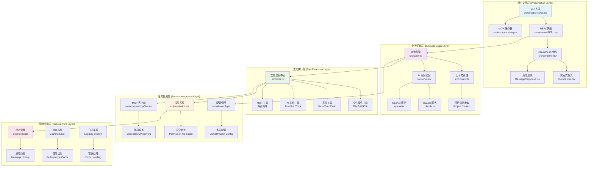
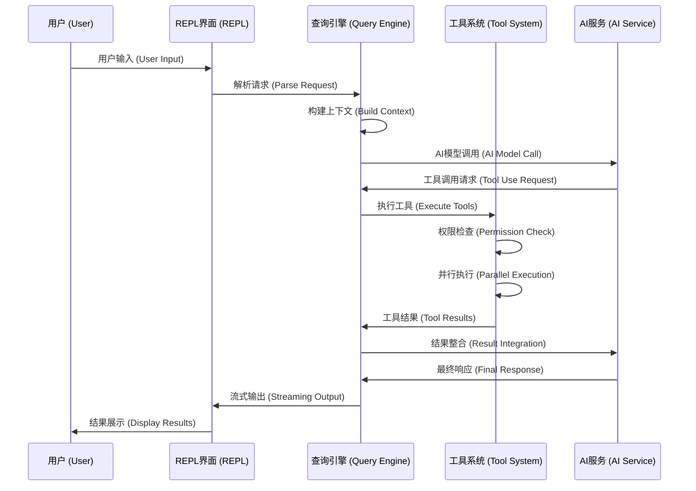

# 系统架构总览

## 宏观架构图 (High-Level Architecture Diagram)



## 分层架构说明 (Layered Architecture)

Kode 采用经典的五层架构模式 (Five-Layer Architecture Pattern)，每一层都有明确的职责边界和接口规范。这种分层设计确保了系统的**可维护性 (Maintainability)**、**可扩展性 (Scalability)** 和**可测试性 (Testability)**。

### 第一层：用户交互层 (Presentation Layer)

**核心职责 (Core Responsibilities)**：
- 处理用户输入输出 (User I/O Handling)
- 终端 UI 渲染 (Terminal UI Rendering)
- 命令解析和路由 (Command Parsing & Routing)
- 多模式支持 (Multi-Mode Support)

**主要组件 (Key Components)**：

#### 1. CLI 入口点 (`src/entrypoints/cli.tsx`)
```typescript
// 双模式启动架构
async function main() {
  const program = new Command()
    .option('--safe', '启用严格权限检查模式')
    .option('-p, --print', '非交互式输出模式')
    .action(async (prompt, options) => {
      if (options.print) {
        // 非交互式模式：执行后退出
        const response = await ask({ prompt, tools })
        console.log(response)
      } else {
        // 交互式模式：启动 REPL 界面
        render(<REPL tools={tools} safeMode={options.safe} />)
      }
    })
}
```

#### 2. REPL 交互界面 (`src/screens/REPL.tsx`)
- **React Hooks 状态管理 (React Hooks State Management)**
- **流式消息渲染 (Streaming Message Rendering)**
- **键盘事件处理 (Keyboard Event Handling)**
- **实时 UI 更新 (Real-time UI Updates)**

#### 3. MCP 服务器模式 (`src/entrypoints/mcp.ts`)
- **JSON-RPC 协议实现 (JSON-RPC Protocol)**
- **工具暴露机制 (Tool Exposure Mechanism)**
- **Claude Desktop 集成 (Claude Desktop Integration)**

**设计模式应用 (Applied Design Patterns)**：
- **命令模式 (Command Pattern)**: 统一的命令处理接口
- **观察者模式 (Observer Pattern)**: UI 状态变更通知
- **适配器模式 (Adapter Pattern)**: 多种输入模式的统一处理

### 第二层：业务逻辑层 (Business Logic Layer)

**核心职责**：
- AI 对话流程控制 (AI Conversation Flow Control)
- 业务规则实现 (Business Rule Implementation)  
- 上下文管理和优化 (Context Management & Optimization)
- 多模型协调策略 (Multi-Model Coordination Strategy)

**关键模块分析**：

#### 查询引擎 (`src/query.ts`) - 系统核心
```typescript
// 核心对话处理流程
export async function query(options: QueryOptions): AsyncGenerator<QueryResult> {
  // 1. 上下文构建 (Context Building)
  const context = await getContext()
  const systemPrompt = formatSystemPromptWithContext(context)
  
  // 2. AI 模型调用 (AI Model Invocation)
  const stream = await queryLLM({
    messages: [...history, { role: 'user', content: prompt }],
    tools: availableTools,
    systemPrompt
  })
  
  // 3. 流式响应处理 (Streaming Response Processing)
  for await (const chunk of stream) {
    if (chunk.type === 'tool_use') {
      // 工具调用处理 (Tool Use Handling)
      const toolResult = await executeTool(chunk.toolCall)
      yield { type: 'tool_result', data: toolResult }
    } else {
      yield { type: 'text', data: chunk.text }
    }
  }
}
```

**架构亮点 (Architectural Highlights)**：
- **异步生成器模式 (Async Generator Pattern)**: 支持流式处理和取消操作
- **策略模式 (Strategy Pattern)**: 不同 AI 服务的统一接口
- **责任链模式 (Chain of Responsibility)**: 上下文处理管道

### 第三层：工具执行层 (Tool Execution Layer)

**设计哲学 (Design Philosophy)**：
> "一切皆工具 (Everything is a Tool)" - 所有功能都抽象为标准化的 Tool 接口

**统一工具接口 (Unified Tool Interface)**：
```typescript
interface Tool {
  // 元数据定义
  name: string
  description(): Promise<string> | string
  
  // 输入验证 (Input Validation)
  inputSchema: z.ZodSchema
  validateInput(input: unknown): boolean
  
  // 权限控制 (Permission Control)
  needsPermissions(): boolean
  isReadOnly(): boolean
  isConcurrencySafe(): boolean
  
  // 核心执行逻辑 (Core Execution Logic)
  call(params: any, context: ToolUseContext): AsyncGenerator<ToolCallResult, ToolResult>
  
  // UI 集成 (UI Integration)
  renderToolUseMessage?(): React.ReactElement
  renderToolResultMessage?(result: ToolResult): React.ReactElement
}
```

**工具分类系统 (Tool Classification System)**：

#### 1. 文件操作工具集 (File Operation Tools)
- `FileReadTool`: 智能文件读取，支持多种格式检测
- `FileWriteTool`: 原子性文件写入，带备份机制
- `FileEditTool`: Git 风格差异编辑，精确文本替换
- `MultiEditTool`: 批量文件编辑，事务性操作保证

#### 2. 系统交互工具集 (System Interaction Tools)  
- `BashTool`: 安全命令执行，沙箱环境隔离
- `GrepTool`: 高性能文本搜索，基于 ripgrep 引擎
- `GlobTool`: 文件模式匹配，支持 .gitignore 语法

#### 3. AI 协作工具集 (AI Collaboration Tools)
- `TaskTool`: 子任务代理系统，支持并行处理
- `AskExpertModelTool`: 专家模型咨询机制
- `ThinkTool`: AI 思维过程可视化

**工具执行控制器 (Tool Execution Controller)**：
```typescript
class ToolExecutionController {
  // 依赖分析和并发控制
  async executeTools(toolCalls: ToolCall[]): Promise<ToolResult[]> {
    const executionPlan = this.analyzeDependencies(toolCalls)
    const results: ToolResult[] = []
    
    // 按阶段并行执行
    for (const stage of executionPlan.stages) {
      const stageResults = await Promise.allSettled(
        stage.map(toolCall => this.executeSafely(toolCall))
      )
      results.push(...this.processResults(stageResults))
    }
    
    return results
  }
}
```

### 第四层：服务集成层 (Service Integration Layer)

**核心职责**：
- 外部服务接入管理 (External Service Integration)
- 权限验证和安全控制 (Permission Validation & Security Control)
- 配置管理和热更新 (Configuration Management & Hot Reload)
- MCP 协议实现 (Model Context Protocol Implementation)

**权限系统架构 (Permission System Architecture)**：
```typescript
// 多层权限验证机制
class PermissionValidator {
  async validatePermission(tool: Tool, params: any): Promise<PermissionResult> {
    const checks = await Promise.all([
      this.toolLevelCheck(tool),           // 工具级检查
      this.sessionLevelCheck(tool.name),   // 会话级检查
      this.pathBoundaryCheck(params),      // 路径边界检查
      this.commandSafetyCheck(params)      // 命令安全检查
    ])
    
    return this.aggregateResults(checks)
  }
}
```

**配置系统层次结构 (Configuration System Hierarchy)**：
1. **环境变量 (Environment Variables)**: 最高优先级
2. **全局配置 (Global Config)**: `~/.kode.json`
3. **项目配置 (Project Config)**: `./.kode.json`  
4. **默认配置 (Default Config)**: 代码中的默认值

### 第五层：基础设施层 (Infrastructure Layer)

**核心组件**：

#### 1. 状态管理系统 (State Management System)
```typescript
// React Context + Hooks 状态管理
const AppContext = createContext<AppState>({
  messages: [],
  tools: [],
  permissions: new Map(),
  config: defaultConfig
})
```

#### 2. 缓存系统 (Caching System)
- **L1 内存缓存 (Memory Cache)**: 热数据快速访问
- **L2 磁盘缓存 (Disk Cache)**: 持久化缓存存储
- **智能失效 (Smart Invalidation)**: 基于文件修改时间的缓存失效

#### 3. 错误处理系统 (Error Handling System)
```typescript
// 全局错误边界
class GlobalErrorHandler {
  handleError(error: Error, context: ErrorContext): void {
    // 1. 错误分类和记录
    this.categorizeAndLog(error, context)
    
    // 2. 恢复策略执行
    this.attemptRecovery(error, context)
    
    // 3. 用户通知
    this.notifyUser(error, context)
  }
}
```

## 架构设计原则 (Architectural Design Principles)

### 1. 单一职责原则 (Single Responsibility Principle)
每个模块、类和函数都有明确定义的单一职责，避免功能耦合。

### 2. 开放封闭原则 (Open/Closed Principle)
系统对扩展开放，对修改封闭。新功能通过实现接口添加，而不是修改现有代码。

### 3. 依赖倒置原则 (Dependency Inversion Principle)  
高层模块不依赖低层模块，都依赖于抽象接口。

### 4. 接口隔离原则 (Interface Segregation Principle)
使用专门的接口，而不是单一的总接口。

### 5. 最少知识原则 (Principle of Least Knowledge)
模块之间只通过定义好的接口通信，减少直接依赖。

## 数据流架构 (Data Flow Architecture)

### 请求处理流程 (Request Processing Flow)


### 状态管理流 (State Management Flow)
- **自上而下数据流 (Top-Down Data Flow)**: Props 传递
- **自下而上事件流 (Bottom-Up Event Flow)**: 回调函数和事件
- **横向状态共享 (Horizontal State Sharing)**: React Context
- **异步状态同步 (Async State Sync)**: useEffect 和 useCallback

## 性能优化架构 (Performance Optimization Architecture)

### 1. 异步处理管道 (Async Processing Pipeline)
```typescript
// 流式处理支持取消和进度报告
async function* streamingProcessor<T>(
  items: T[],
  processor: (item: T) => Promise<ProcessResult>
): AsyncGenerator<ProgressUpdate, T[]> {
  const results: T[] = []
  
  for (let i = 0; i < items.length; i++) {
    yield { progress: i / items.length * 100, message: `处理中 ${i+1}/${items.length}` }
    const result = await processor(items[i])
    results.push(result)
  }
  
  return results
}
```

### 2. 智能缓存策略 (Intelligent Caching Strategy)
- **缓存键生成 (Cache Key Generation)**: 基于内容哈希
- **TTL 管理 (TTL Management)**: 智能过期时间设置
- **缓存预热 (Cache Warming)**: 预加载常用数据
- **内存压力处理 (Memory Pressure Handling)**: LRU 淘汰策略

### 3. 并发控制机制 (Concurrency Control Mechanism)
```typescript
// 信号量控制并发数量
class Semaphore {
  constructor(private permits: number) {}
  
  async acquire(): Promise<() => void> {
    await this.waitForPermit()
    return () => this.release()
  }
}

// 使用示例
const toolSemaphore = new Semaphore(3) // 最多3个工具并行执行
```

## 安全架构设计 (Security Architecture Design)

### 多层防护体系 (Multi-Layer Defense System)
1. **输入验证层 (Input Validation Layer)**: Zod 模式验证
2. **权限控制层 (Permission Control Layer)**: 细粒度权限检查  
3. **沙箱执行层 (Sandbox Execution Layer)**: 隔离危险操作
4. **输出过滤层 (Output Filtering Layer)**: 敏感信息过滤

### 威胁模型 (Threat Model)
- **代码注入攻击 (Code Injection)**: 命令参数验证和转义
- **路径遍历攻击 (Path Traversal)**: 路径标准化和边界检查
- **权限提升 (Privilege Escalation)**: 最小权限原则
- **信息泄露 (Information Disclosure)**: 敏感数据脱敏

---

这个架构设计为 Kode 提供了**坚实的技术基础**，支持**快速功能迭代**和**大规模扩展**。通过清晰的分层结构和标准化接口，系统具备了优秀的**可维护性**和**可测试性**。