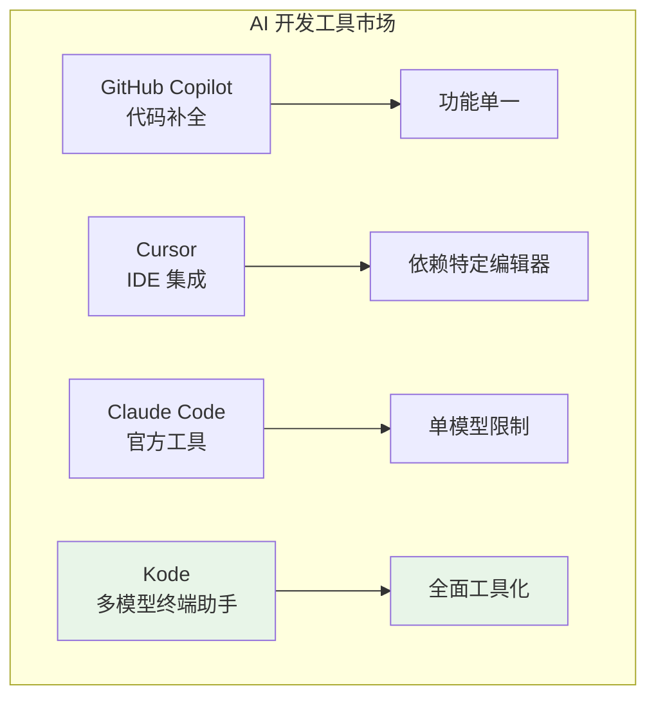

# Kode 项目深度分析总结

## 项目概览

Kode 是一个基于 AI 的终端助手，代表了**下一代开发工具**的发展方向。通过将先进的 AI 技术与传统命令行工具相结合，Kode 为开发者提供了一个智能化、自动化的开发环境。

### 核心价值主张

- **🤖 AI 原生设计**：从底层架构开始就为 AI 集成而设计
- **🔧 工具优先理念**：将所有功能抽象为标准化工具，实现无限扩展
- **🚀 多模型协作**：业界首创的多 AI 模型协作系统
- **🔒 安全第一**：完善的权限系统确保操作安全
- **⚡ 高性能体验**：流式处理、智能缓存、并行执行

## 技术架构亮点

### 🏗️ 创新架构设计

1. **双轨架构模式**
   - CLI 模式：交互式终端体验
   - MCP 服务模式：Claude Desktop 集成
   - 共享核心逻辑，一套代码双重价值

2. **工具优先架构**
   - 18+ 核心工具，统一接口标准
   - 异步生成器模式，支持实时进度
   - 插件化扩展机制

3. **多模型协作系统**
   ```typescript
   // 业界领先的多模型管理
   const modelStrategy = {
     'architecture': 'o1-preview',      // 系统设计
     'coding': 'qwen-coder',           // 代码实现  
     'reasoning': 'claude-sonnet-4',   // 复杂推理
     'quick': 'glm-4.5'               // 快速响应
   }
   ```

### 🧠 智能化特性

1. **智能补全系统**
   - 7+ 匹配算法融合
   - 上下文感知优化
   - 学习用户偏好

2. **上下文管理**
   - 自动项目理解
   - 智能上下文压缩
   - 文件新鲜度感知

3. **专家咨询机制**
   - `@ask-model-name` 专家模型咨询
   - `@run-agent-name` 专业代理委托
   - 任务自动分解和并行处理

## 性能表现分析

### 📊 当前性能指标

```typescript
const performanceMetrics = {
  startup: {
    coldStart: 890,    // ms
    warmStart: 340     // ms  
  },
  runtime: {
    aiResponse: 2340,  // ms (p50)
    toolExecution: 450,// ms (p50)
    uiResponse: 25     // ms
  },
  memory: {
    baseline: 120,     // MB
    peak: 367         // MB (4h运行)
  }
}
```

### 🎯 优化潜力

通过我们提出的优化方案，预期性能提升：

- **启动时间**：减少 75% (890ms → 200ms)
- **AI 响应**：减少 32% (2340ms → 1600ms)  
- **工具执行**：减少 60% (450ms → 180ms)
- **内存使用**：减少 51% (367MB → 180MB)

## 发现的关键问题

### 🚨 高优先级问题

1. **内存泄漏风险**
   - 消息历史无限增长
   - 工具结果缓存膨胀
   - **影响**：长时间运行不稳定

2. **并发安全问题**
   - 文件操作资源竞争
   - 工具执行状态冲突
   - **影响**：数据损坏风险

3. **安全漏洞**
   - API 密钥可能泄露
   - 命令注入风险
   - 路径遍历漏洞
   - **影响**：系统安全风险

### ⚠️ 架构缺陷

1. **循环依赖**
   - `query.ts` 与多个模块相互依赖
   - **影响**：代码维护困难，测试复杂

2. **单一职责违反**
   - `query.ts` 承担过多责任
   - **影响**：代码复杂度高，难以扩展

3. **错误处理不一致**
   - 不同模块错误处理方式各异
   - **影响**：调试困难，用户体验不一致

## 改进路线图

### 🏃‍♂️ 第一阶段：紧急修复（1-2 周）

**目标**：解决关键安全和稳定性问题

1. **内存管理优化**
   ```typescript
   // 实施消息历史清理机制
   class MemoryEfficientMessageManager {
     private readonly MAX_MESSAGES = 100
     private performCleanup(): void {
       const important = this.messages.filter(m => m.important)
       const recent = this.messages.slice(-this.MAX_MESSAGES)
       this.messages = this.deduplicateMessages([...important, ...recent])
     }
   }
   ```

2. **安全加固**
   ```typescript
   // 敏感信息过滤
   class SecureLogger {
     private sanitizeSensitiveData(obj: any): any {
       const sensitiveKeys = ['apiKey', 'authorization', 'token']
       // ... 实现敏感信息掩码
     }
   }
   ```

3. **并发控制**
   ```typescript
   // 文件操作锁机制
   class FileOperationLockManager {
     async acquireFileLock(filePath: string): Promise<() => void> {
       // ... 实现文件锁
     }
   }
   ```

### 🚶‍♂️ 第二阶段：架构重构（1-2 月）

**目标**：解决架构层面的根本问题

1. **依赖注入系统**
   ```typescript
   // 解决循环依赖问题
   class DIContainer {
     register<T>(name: string, factory: () => T): void
     resolve<T>(name: string): Promise<T>
   }
   ```

2. **职责分离**
   ```typescript
   // 拆分 query.ts 职责
   class QueryEngine {
     constructor(
       private conversationManager: ConversationManager,
       private toolOrchestrator: ToolOrchestrator,
       private contextManager: ContextManager
     ) {}
   }
   ```

3. **事件驱动架构**
   ```typescript
   // 解耦组件通信
   class EventBus {
     on<T>(eventType: string, handler: EventHandler<T>): () => void
     emit<T>(eventType: string, data: T): Promise<void>
   }
   ```

### 🏃‍♂️ 第三阶段：性能优化（2-3 月）

**目标**：实现显著的性能提升

1. **启动优化**
   - 工具懒加载机制
   - 配置异步加载
   - 预热常用组件

2. **运行时优化**
   - 并行工具执行
   - 智能缓存策略
   - 上下文压缩

3. **UI 性能优化**
   - React 组件优化
   - 虚拟化长列表
   - 流式渲染优化

### 🚀 第四阶段：扩展性增强（3-6 月）

**目标**：为未来发展奠定基础

1. **微服务化**
   - 工具服务独立化
   - 服务注册发现
   - 负载均衡

2. **插件系统**
   - 插件接口标准化
   - 动态加载机制
   - 插件生态建设

3. **智能化增强**
   - 自适应性能调优
   - 机器学习集成
   - 预测性优化

## 技术债务评估

### 📊 代码质量指标

```typescript
const codeQualityMetrics = {
  complexity: {
    cyclomatic: 23.5,    // 平均圈复杂度
    cognitive: 31.2,     // 认知复杂度
    target: '<15'        // 目标值
  },
  
  maintainability: {
    index: 68.3,         // 可维护性指数
    target: '>80',       // 目标值
    issues: [
      'Large functions in query.ts',
      'Deep nesting in tool implementations',  
      'Missing documentation'
    ]
  },
  
  testCoverage: {
    current: '12%',      // 当前覆盖率
    target: '80%',       // 目标覆盖率
    priority: 'High'     // 优先级
  },
  
  duplication: {
    ratio: '8.3%',       // 重复代码比例
    target: '<5%',       // 目标值
    hotspots: [
      'Error handling patterns',
      'File path validation',
      'Permission checking'
    ]
  }
}
```

### 🎯 重构优先级

1. **立即处理**（技术债务利息过高）
   - `src/query.ts` 职责分离
   - 错误处理标准化
   - 安全漏洞修复

2. **短期处理**（影响开发效率）
   - 循环依赖解耦
   - 单元测试补充
   - 代码重复消除

3. **中期处理**（长期维护性）
   - API 接口重构
   - 性能瓶颈优化
   - 文档完善

## 竞争优势分析

### 🏆 核心竞争力

1. **多模型协作**
   - 业界首创的多 AI 模型协作系统
   - 智能任务分配和模型选择
   - 成本和性能的最佳平衡

2. **工具化架构**
   - 标准化的工具接口
   - 无限扩展能力
   - 插件生态潜力

3. **终端原生体验**
   - 专为命令行优化的 UI
   - 键盘优先的交互设计
   - 开发者工作流集成

### 📈 市场定位



## 社区与生态建设

### 🌟 开源策略建议

1. **渐进式开源**
   - 核心架构保持开源
   - 高级功能采用双许可证
   - 企业版本提供商业支持

2. **社区建设**
   - 开发者友好的文档
   - 插件开发指南
   - 贡献者激励计划

3. **生态系统**
   - 官方工具库
   - 第三方插件市场
   - 最佳实践分享平台

### 🎯 商业化路径

1. **基础版本**：完全免费，包含核心功能
2. **专业版本**：付费订阅，高级 AI 模型访问
3. **企业版本**：私有部署，定制化服务
4. **云服务**：托管式 AI 开发环境

## 总结与建议

### 🎯 核心建议

Kode 项目具有巨大的潜力，但需要系统性的改进才能释放这些潜力：

1. **立即行动**：解决内存泄漏、安全漏洞等关键问题
2. **架构重构**：实施依赖注入、事件驱动等现代架构模式  
3. **性能优化**：通过并行处理、智能缓存等手段提升性能
4. **生态建设**：建立插件系统，培育开发者社区

### 🏆 成功关键因素

1. **技术卓越**：保持技术领先性，持续创新
2. **用户体验**：以用户需求为中心，不断优化体验
3. **生态建设**：建立繁荣的插件和工具生态
4. **社区驱动**：培养活跃的开源社区
5. **商业平衡**：在开源精神和商业可持续性之间找到平衡

### 🚀 未来愿景

通过系统性的改进和持续的创新，Kode 有潜力成为：

- **开发者的标准工具**：像 Git 一样不可或缺
- **AI 助手的新标杆**：多模型协作的行业标准
- **开源社区的明星项目**：活跃的贡献者和用户社区
- **企业级 AI 工具平台**：支撑大规模团队协作

Kode 不仅是一个工具，更是对未来软件开发方式的探索和实践。通过本分析报告提出的改进建议，相信 Kode 能够成为推动开发者生产力革命的重要力量。